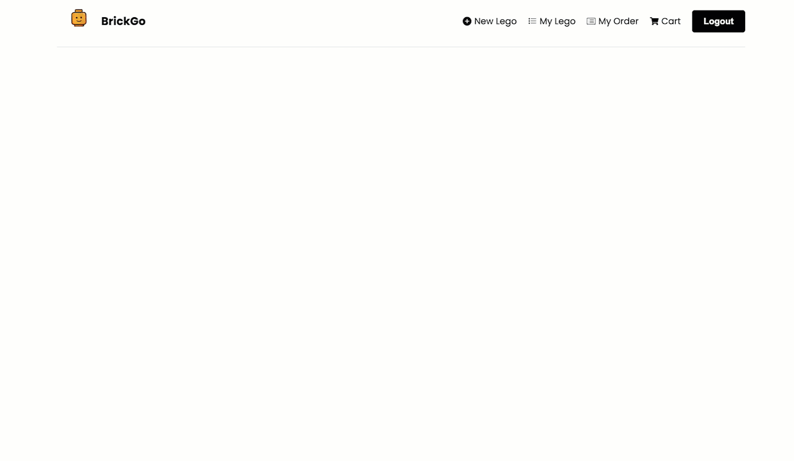
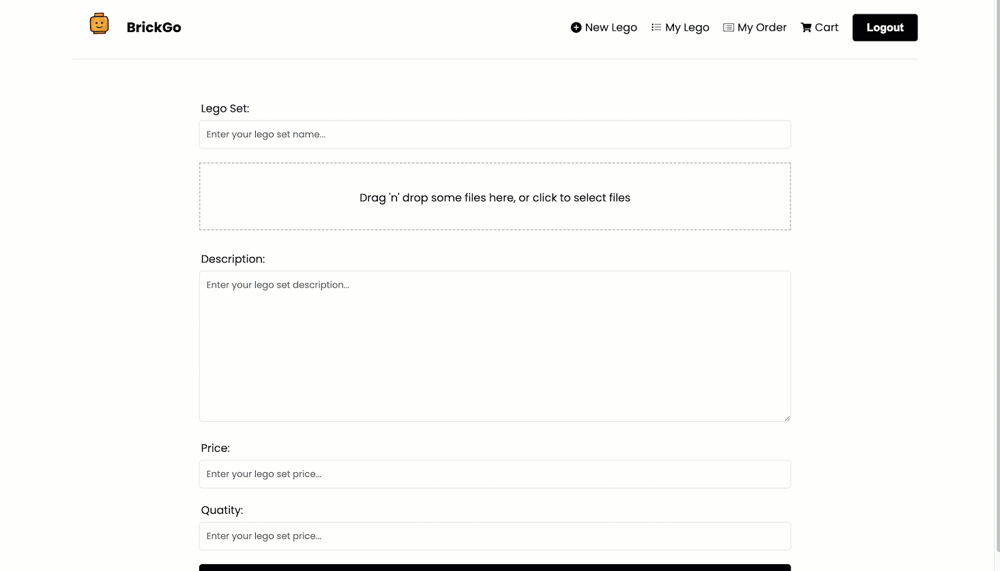
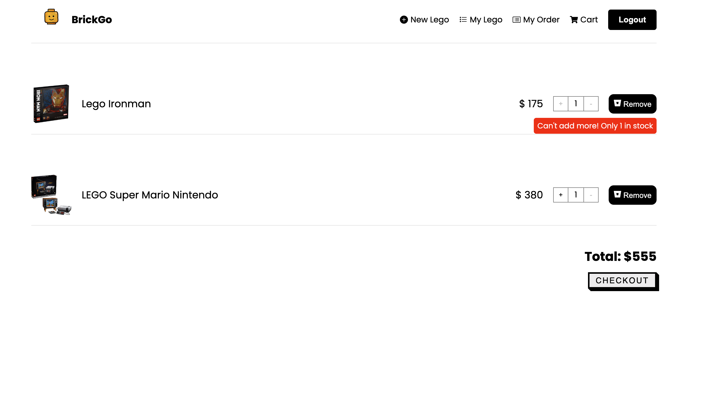
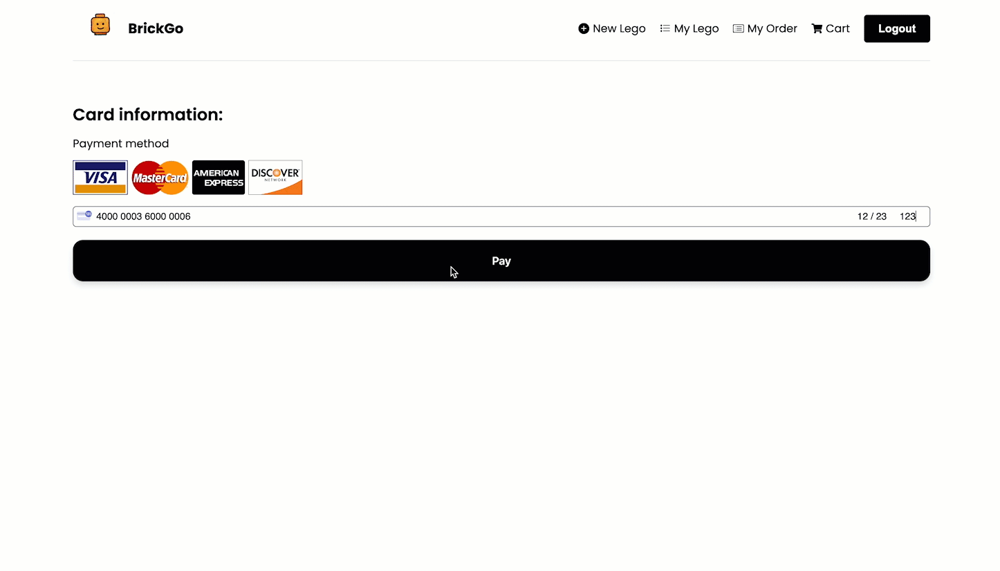

# BrickGo

A great e-commerce online platform for user to trade their extra lego set! </br>

**_Frontend: REACT_** </br>
**_Backend: Node.js, Express.js and MongoDB_**
**Other:Heroku, Cloudinary, Netlify, Stripe**

Click here to play: https://brick-go.netlify.app/

```
username: mandy@ga.co
password: 123123
```

## ScreenShots

Pop-up Animations </br>

Easy drag and drop images </br>

Always help to check the stockability in your cart </br>

Payment with stripe & cute loading animation</br>


## More to improve

Since I got covid in my last week, so there are a lot things could be improved in furture!

1. Need a loading animation after clicking pay button
2. Add a filter function in the list page
3. Update the css style
